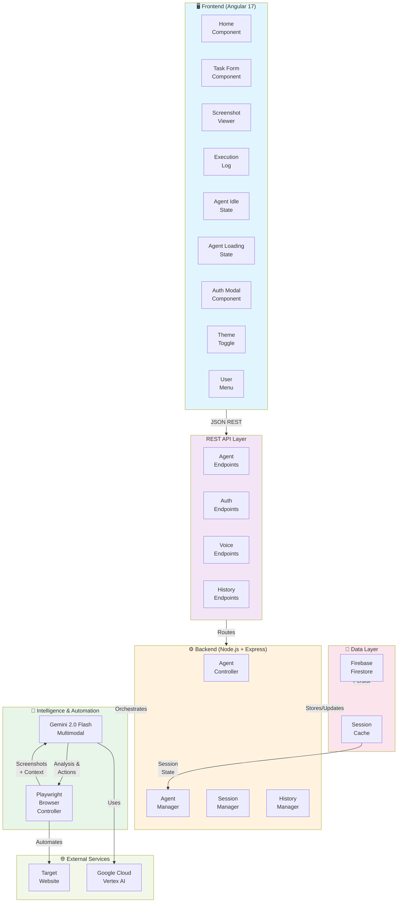
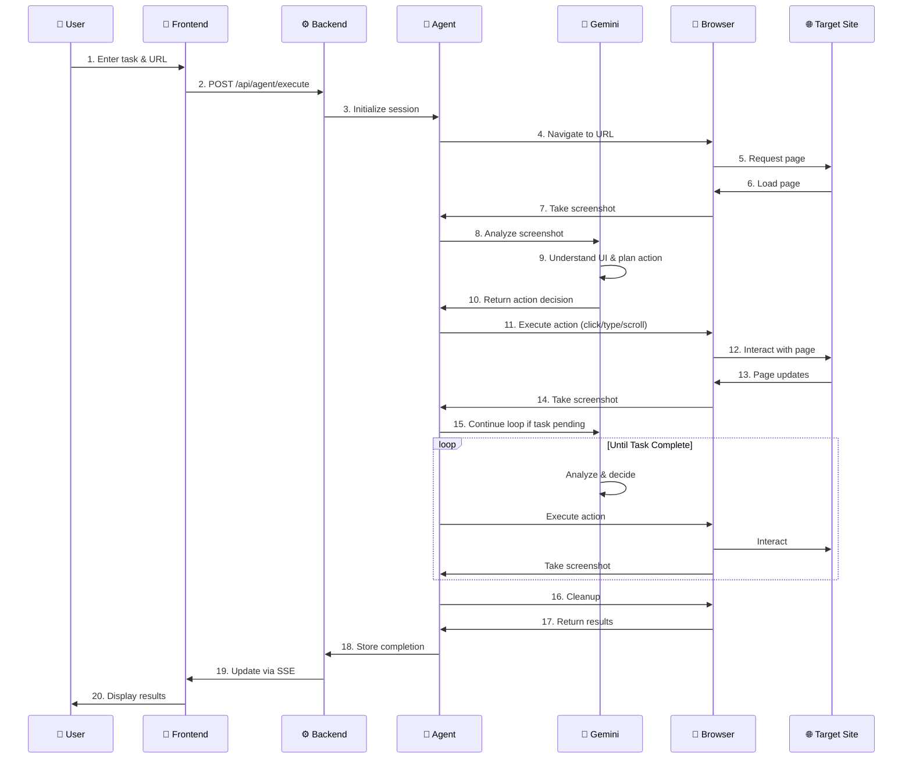
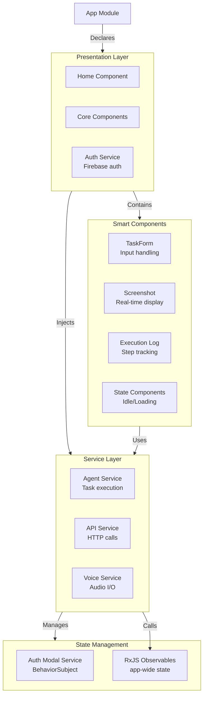
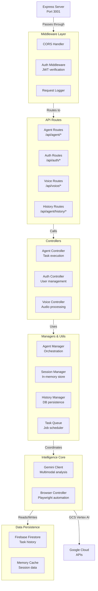

# Wayfinder AI - System Architecture

## High-Level Architecture



## Data Flow Diagram



## Component Architecture



## Backend Architecture



## Technology Stack

### Frontend
- **Framework**: Angular 17 (TypeScript)
- **Styling**: SCSS with CSS Custom Properties
- **Authentication**: Firebase Auth (Google Sign-in)
- **HTTP**: Angular HttpClient + Axios
- **State**: RxJS Observables + BehaviorSubjects
- **Build**: webpack (via Angular CLI)

### Backend
- **Runtime**: Node.js 18+
- **Framework**: Express.js (TypeScript)
- **Browser Automation**: Playwright
- **AI/ML**: Google Gemini 2.0 Flash (via Vertex AI)
- **Database**: Firebase Firestore
- **Cache**: In-memory SessionManager
- **API Communication**: Axios
- **Server-Sent Events**: Express native support

### Infrastructure
- **Containerization**: Docker & Docker Compose
- **Cloud Platform**: Google Cloud (Cloud Run, Vertex AI)
- **Frontend Hosting**: Firebase Hosting (optional)
- **Code Repository**: GitHub

## Key Integration Points

### Gemini Integration
```
Browser Screenshot (1280x720px)
    ↓
Gemini 2.0 Flash Multimodal
    ├─→ Visual Understanding (identify UI elements)
    ├─→ Context Analysis (page purpose)
    ├─→ Action Planning (next step decision)
    └─→ Response (structured JSON action)
        {
          "action": "click|type|scroll|navigate",
          "selector": "string",
          "value": "string",
          "reasoning": "string"
        }
```

### Playwright Integration
```
Gemini Action Decision
    ↓
Playwright Browser Controller
    ├─→ Navigate to URL
    ├─→ Wait for elements
    ├─→ Execute action (click, type, scroll)
    ├─→ Handle navigation/loading
    ├─→ Take screenshot
    └─→ Return to Agent Manager
```

### Firebase Integration
```
Frontend (Angular)
    ↓
Firebase Auth SDK
    ├─→ Google Sign-in
    ├─→ Token management
    └─→ User profile
        ↓
Backend Auth Middleware
    ├─→ Verify JWT token
    ├─→ Get user context
    └─→ Authorize requests
        ↓
Firestore
    ├─→ Store task history
    ├─→ Persist user preferences
    └─→ Track usage stats
```

## Message Formats

### Execute Task Request
```json
{
  "taskDescription": "Fill in contact form with John Doe",
  "startUrl": "https://example.com/contact",
  "context": {
    "userEmail": "user@example.com",
    "phoneNumber": "555-0123"
  }
}
```

### Task Status Response
```json
{
  "id": "session-abc123",
  "status": "running|completed|failed",
  "task": {
    "taskDescription": "...",
    "startUrl": "...",
    "progress": 45
  },
  "steps": [
    {
      "stepNumber": 1,
      "description": "Clicked on email input field",
      "action": {
        "type": "click",
        "selector": "input#email",
        "target": "email input"
      },
      "screenshot": "base64-encoded-image",
      "timestamp": "2026-02-25T10:30:00Z",
      "success": true
    }
  ],
  "currentScreenshot": "base64-encoded-image"
}
```

### SSE Stream Format
```
event: update
data: {"status":"running","steps":[...]}

event: update  
data: {"status":"completed","steps":[...]}
```

## Deployment Architecture

```
┌──────────────────────────────────────────────────┐
│           Google Cloud Platform                  │
│                                                  │
│  ┌────────────────────────────────────────────┐ │
│  │         Cloud Run (Backend)                │ │
│  │  - Containerized Node.js + Express         │ │
│  │  - Auto-scaling based on requests          │ │
│  │  - Environment: Google Cloud credentials   │ │
│  └────────────────────────────────────────────┘ │
│                     ↕                            │
│  ┌────────────────────────────────────────────┐ │
│  │      Vertex AI (Gemini API)                │ │
│  │  - Multimodal analysis via REST API        │ │
│  │  - Vision understanding                    │ │
│  │  - Action generation                       │ │
│  └────────────────────────────────────────────┘ │
│                     ↕                            │
│  ┌────────────────────────────────────────────┐ │
│  │     Firestore (Database)                   │ │
│  │  - Task history                            │ │
│  │  - User preferences                        │ │
│  │  - Usage statistics                        │ │
│  └────────────────────────────────────────────┘ │
└──────────────────────────────────────────────────┘
           ↕
┌──────────────────────────────────────────────────┐
│      Firebase Hosting (Frontend)                 │
│  - Angular production build                      │
│  - Static assets                                 │
│  - CDN distribution                              │
└──────────────────────────────────────────────────┘
           ↕
┌──────────────────────────────────────────────────┐
│           User Browser                           │
│  - Angular 17 SPA                                │
│  - WebSocket/SSE for real-time updates           │
└──────────────────────────────────────────────────┘
```

## Error Handling & Resilience

```
Request
   ↓
Validation
   ├─→ Invalid input → 400 Bad Request
   └─→ Valid
        ↓
    Authentication
       ├─→ No token → 401 Unauthorized
       ├─→ Invalid token → 403 Forbidden
       └─→ Valid
            ↓
        Rate Limiting
           ├─→ Exceeded → 429 Too Many Requests
           └─→ OK
                ↓
            Business Logic
               ├─→ Resource not found → 404
               ├─→ Conflict → 409
               ├─→ Service unavailable → 503
               └─→ Success → 200/201
```

---

**Last Updated**: February 25, 2026  
**Contest**: Google Gemini Live Agent Challenge 2026  
**Category**: UI Navigator
