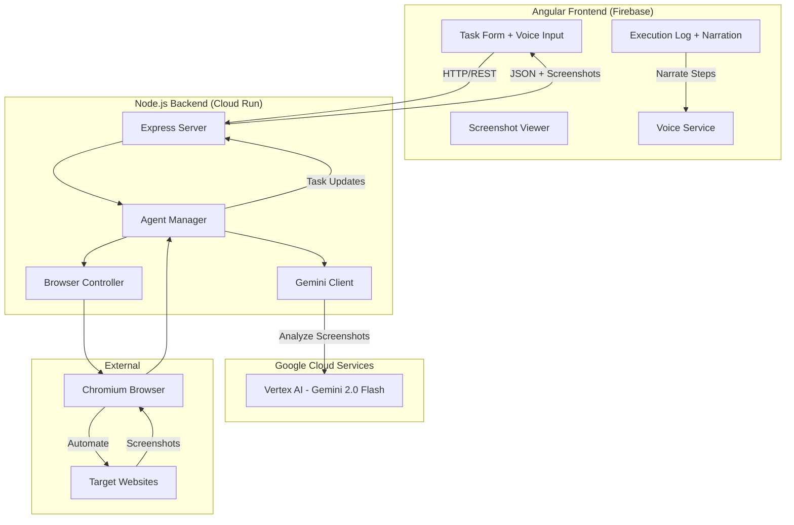

# Architecture Diagram for Wayfinder AI

## Visual Architecture (Draw.io Format)

For your Devpost submission, create a diagram showing this architecture:

```
┌─────────────────────────────────────────────────────────────────────┐
│                         USER INTERACTION                            │
│                                                                     │
│   🎤 Voice Input ────┐                        ┌──── 🔊 Voice Output│
│   ⌨️  Text Input ────┤                        │                     │
│                      │                        │                     │
└──────────────────────┼────────────────────────┼─────────────────────┘
                       │                        │
                       ▼                        ▼
┌──────────────────────────────────────────────────────────────────────┐
│                    ANGULAR FRONTEND (Firebase Hosting)               │
│                                                                      │
│  ┌──────────────┐  ┌──────────────────┐  ┌─────────────────────┐  │
│  │  Task Form   │  │ Screenshot       │  │  Execution Log      │  │
│  │ Component    │  │ Viewer           │  │  Component          │  │
│  │              │  │                  │  │                     │  │
│  │ - URL input  │  │ - Live updates   │  │ - Step tracking    │  │
│  │ - Voice UI   │  │ - 16:9 display   │  │ - Voice narration  │  │
│  └──────────────┘  └──────────────────┘  └─────────────────────┘  │
│                                                                      │
│  ┌──────────────────────────────────────────────────────────────┐  │
│  │              Voice Service (Web Speech API)                  │  │
│  │  - Speech Recognition (STT)                                  │  │
│  │  - Speech Synthesis (TTS)                                    │  │
│  └──────────────────────────────────────────────────────────────┘  │
└──────────────────────────┬────────────────────▲──────────────────────┘
                           │                    │
                HTTP/REST  │                    │  JSON + Base64
                           │                    │  Screenshots
                           ▼                    │
┌───────────────────────────────────────────────────────────────────────┐
│              NODE.JS BACKEND (Google Cloud Run)                       │
│                                                                       │
│  ┌─────────────────────────────────────────────────────────────────┐ │
│  │                     Express.js Server                           │ │
│  │  ┌──────────────────┐          ┌─────────────────────────┐     │ │
│  │  │ Agent Controller │          │  User Controller        │     │ │
│  │  │ - /execute       │          │  - Health checks        │     │ │
│  │  │ - /status        │          │                         │     │ │
│  │  └──────────────────┘          └─────────────────────────┘     │ │
│  └─────────────────────────────────────────────────────────────────┘ │
│                           │                │                          │
│                           │                │                          │
│                           ▼                ▼                          │
│  ┌────────────────────────────────────────────────────────────────┐  │
│  │                    AGENT MANAGER                               │  │
│  │                                                                │  │
│  │  Orchestrates the AI decision loop:                           │  │
│  │  1. Take screenshot                                           │  │
│  │  2. Send to Gemini for analysis                              │  │
│  │  3. Get action decision                                       │  │
│  │  4. Execute browser action                                    │  │
│  │  5. Update task state                                         │  │
│  │  6. Repeat until complete                                     │  │
│  └───────────┬──────────────────────────┬─────────────────────────┘  │
│              │                          │                            │
│              │                          │                            │
│              ▼                          ▼                            │
│  ┌─────────────────────┐    ┌─────────────────────────────────┐    │
│  │   GEMINI CLIENT     │    │  BROWSER CONTROLLER             │    │
│  │                     │    │                                 │    │
  │  │ - Screenshot        │    │ - Playwright integration        │    │
│  │   analysis          │    │ - Browser pool management      │    │
│  │ - Decision making   │    │ - Action execution:            │    │
│  │ - Task completion   │    │   * Click                      │    │
│  │   detection         │    │   * Type                       │    │
│  │ - Personality       │    │   * Navigate                   │    │
│  │   prompts           │    │   * Scroll                     │    │
│  │ - Rate limiting     │    │   * Screenshot                 │    │
│  │ - Error handling    │    │ - Auto-recovery                │    │
│  └─────────┬───────────┘    └──────────┬──────────────────────┘    │
│            │                           │                            │
└────────────┼───────────────────────────┼────────────────────────────┘
             │                           │
             │                           │
             ▼                           ▼
┌─────────────────────────┐   ┌────────────────────────────────────┐
│   GOOGLE CLOUD          │   │     CHROMIUM BROWSER               │
│   VERTEX AI API         │   │                                    │
│                         │   │  ┌──────────────────────────────┐  │
│  ┌──────────────────┐   │   │  │  Headless Browser Instance   │  │
│  │  Gemini 2.0      │   │   │  │                              │  │
│  │  Flash Model     │   │   │  │  - Renders web pages        │  │
│  │                  │   │   │  │  - Executes JavaScript      │  │
│  │ Multimodal:      │   │   │  │  - Takes screenshots        │  │
│  │ - Vision         │   │   │  │  - Navigates websites       │  │
│  │ - Language       │   │   │  └──────────────────────────────┘  │
│  │ - Reasoning      │   │   │                                    │
│  └──────────────────┘   │   └────────────────────────────────────┘
│                         │
│  Features Used:         │
│  - Image understanding  │                  ┌──────────────────────┐
│  - JSON output          │                  │  EXTERNAL WEBSITES   │
│  - Function calling     │◄─────────────────┤                      │
│  - Rate limit handling  │    Automation    │  - google.com       │
│                         │    target        │  - amazon.com       │
└─────────────────────────┘                  │  - any website      │
                                             └──────────────────────┘

KEY FEATURES:
══════════════

🎤 MULTIMODAL INPUT                    🎯 VISUAL UNDERSTANDING
   - Voice commands                       - Screenshot analysis
   - Text input                           - No DOM required
   - Natural language                     - Works on any site

🤖 INTELLIGENT AGENT                   🔄 FEEDBACK LOOP
   - Gemini decision making               - Real-time adaptation  
   - Personality & voice                  - Error recovery
   - Context awareness                    - Task completion detection

☁️  GOOGLE CLOUD NATIVE                📊 LIVE MONITORING
   - Fully hosted on GCP                  - Real-time screenshots
   - Vertex AI integration                - Step-by-step logging
   - Scalable architecture                - Voice narration
```

## How to Create This Diagram:

### Option 1: Using Draw.io (Recommended)
1. Go to https://app.diagrams.net/
2. Create new diagram
3. Use these shapes:
   - Rectangles with rounded corners for services
   - Cylinders for databases/models
   - Arrows for data flow
   - Different colors for different layers:
     - Blue: Frontend
     - Green: Backend
     - Orange: Google Cloud
     - Purple: Browser

### Option 2: Using Excalidraw
1. Go to https://excalidraw.com/
2. Hand-drawn style looks modern and friendly
3. Export as PNG

### Option 3: Using Mermaid (In your README.md)


## What to Highlight in Your Diagram:

1. **Multimodal Flow**: Show voice → text → Gemini → actions
2. **Google Cloud Components**: 
   - Cloud Run (backend hosting)
   - Vertex AI (Gemini API)
   - Firebase (frontend hosting)
3. **Data Flow**:
   - User intent → Backend
   - Screenshot → Gemini
   - Decision → Browser action
   - Result → User
4. **Key Differentiators**:
   - Voice input/output
   - Visual understanding
   - No DOM access needed
   - Works on any website

## Labels to Add:

- "Multimodal Input/Output" near voice components
- "Visual Understanding" near screenshot analysis
- "Google Cloud Native" near GCP services
- "Agent Decision Loop" near Agent Manager
- "Browser Automation" near Playwright

## Export Settings:

- **Format**: PNG or SVG
- **Resolution**: At least 1920x1080
- **File size**: Under 5MB
- **Include legend**: Yes (explain colors/shapes)

## Where to Include:

1. **README.md**: Embed as image
2. **Devpost submission**: Upload as image
3. **Demo video**: Show for 10-15 seconds around 0:45-1:00
4. **Separate file**: `architecture-diagram.png` in repo root

---

Save your diagram as:
- `docs/architecture-diagram.png`
- `docs/architecture-diagram.svg`
- Reference in README with: ``
